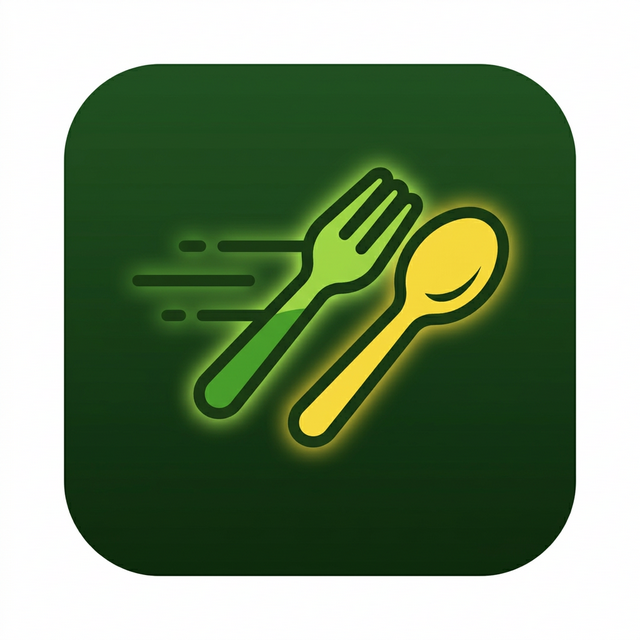

<p align="center">
  
</p>

<h1 align="center">🍴 Quick Bites</h1>

<p align="center">
  <b>Discover, save, and cook delicious recipes — all in one place.</b>
</p>

<p align="center">
  
  
  
  
  
</p>

<p align="center">
  
  
  
</p>

---

## ✨ Features

- 🏠 **Home Feed** — Browse a curated, always-fresh selection of random recipes
- ⭐ **Featured Recipe** — A daily highlighted recipe to spark your culinary inspiration
- 🗂️ **Category Filtering** — Filter recipes by cuisine category (Chicken, Beef, Dessert, and more)
- 🔍 **Search** — Instantly search across thousands of meals
- ❤️ **Favorites** — Save your favourite recipes to a personal collection, synced to the cloud
- 🌙 **Dark / Light Themes** — Switch between multiple gorgeous colour themes on the fly
- 🔐 **Authentication** — Secure sign-up, sign-in, and email verification powered by Clerk
- 💨 **Custom Splash Screen** — A branded launch experience for a polished first impression
- 📱 **Cross-Platform** — Runs natively on both Android and iOS

---

## 🏗️ Project Structure

```
Quick_Bites/
├── 📱 mobile/               # Expo React Native app
│   ├── app/
│   │   ├── (auth)/          # Sign-in, Sign-up, Verify Email screens
│   │   ├── (tabs)/          # Home, Search, Favorites tab screens
│   │   └── recipe/          # Recipe detail screen
│   ├── components/          # Reusable UI components
│   ├── context/             # Theme & Auth context providers
│   ├── services/            # MealDB API service layer
│   ├── assets/              # Images, icons, styles
│   └── app.json             # Expo configuration
│
└── 🖥️ backend/              # Node.js / Express REST API
    └── src/
        ├── config/          # DB, env, cron configuration
        ├── db/              # Drizzle ORM schema
        └── server.js        # API entry point
```

---

## 🛠️ Tech Stack

### 📱 Mobile (Frontend)

| Technology | Purpose |
|---|---|
| **React Native 0.81** | Core mobile framework |
| **Expo SDK 54** | Development toolchain & native APIs |
| **Expo Router** | File-based navigation |
| **Clerk** | Authentication (sign-up, sign-in, email verify) |
| **React Native Reanimated** | Smooth animations |
| **Expo Linear Gradient** | Beautiful gradient UI elements |
| **Expo Image** | High-performance image loading |
| **Expo Secure Store** | Secure local token storage |

### 🖥️ Backend (API)

| Technology | Purpose |
|---|---|
| **Express 5.1** | REST API server |
| **Neon Serverless DB** | PostgreSQL (serverless) |
| **Drizzle ORM** | Type-safe database queries |
| **Cron** | Periodic jobs (e.g. keep-alive pings) |
| **dotenv** | Environment variable management |

### 🌐 External APIs

| API | Purpose |
|---|---|
| **[TheMealDB](https://www.themealdb.com/)** | Recipe data, images, categories |

---

## 🚀 Getting Started

### Prerequisites

- [Node.js](https://nodejs.org/) v18+
- [Expo CLI](https://docs.expo.dev/get-started/installation/) — `npm install -g expo-cli`
- [Expo Go](https://expo.dev/client) app on your device, or an Android/iOS emulator

---

### 1. Clone the Repository

```bash
git clone https://github.com/Kanishkau4/Recipte_App.git
cd Recipte_App
```

---

### 2. Backend Setup

```bash
cd backend

# Install dependencies
npm install

# Create environment file
cp .env.example .env
# Fill in DATABASE_URL, PORT, and NODE_ENV

# Start the development server
npm run dev
```

**Backend API Endpoints:**

| Method | Endpoint | Description |
|---|---|---|
| `GET` | `/api/health` | Health check |
| `POST` | `/api/favorites` | Add a recipe to favourites |
| `GET` | `/api/favorites/:userId` | Get all favourites for a user |
| `DELETE` | `/api/favorites/:userId/:recipeId` | Remove a recipe from favourites |

---

### 3. Mobile App Setup

```bash
cd mobile

# Install dependencies
npm install

# Create environment file and add your Clerk Publishable Key & Backend URL
# EXPO_PUBLIC_CLERK_PUBLISHABLE_KEY=your_clerk_key
# EXPO_PUBLIC_API_URL=http://your-backend-url

# Start the Expo dev server
npx expo start -c
```

Scan the QR code with **Expo Go** or press `a` for Android / `i` for iOS emulator.

---

## 📸 App Screens

| Home | Search | Favorites |
|:---:|:---:|:---:|
| Featured recipe hero card, category filters & recipe grid | Live meal search with instant results | Cloud-synced personal recipe collection |

| Recipe Detail | Sign In | Theme Picker |
|:---:|:---:|:---:|
| Full ingredients, step-by-step instructions & YouTube link | Clerk-powered auth with email verification | Switch app accent color in real-time |

---

## 🔐 Environment Variables

### `mobile/.env`
```env
EXPO_PUBLIC_CLERK_PUBLISHABLE_KEY=your_clerk_publishable_key
EXPO_PUBLIC_API_URL=https://your-backend-api-url
```

### `backend/.env`
```env
DATABASE_URL=your_neon_database_url
PORT=3000
NODE_ENV=development
```

---

## 🤝 Contributing

Contributions, issues, and feature requests are welcome! Feel free to open a pull request or issue.

1. Fork the repository
2. Create your feature branch: `git checkout -b feature/awesome-feature`
3. Commit your changes: `git commit -m 'Add awesome feature'`
4. Push to the branch: `git push origin feature/awesome-feature`
5. Open a Pull Request

---

## 📄 License

This project is licensed under the **ISC License**.

---

<p align="center">
  Made with ❤️ by <b>Kanishka</b> &nbsp;·&nbsp; Powered by <b>TheMealDB</b>
</p>
